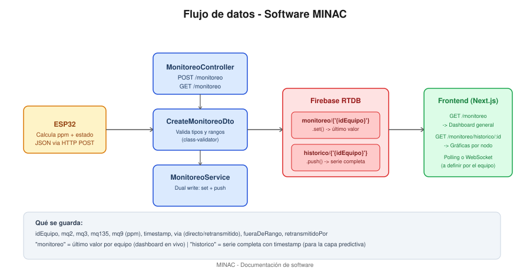
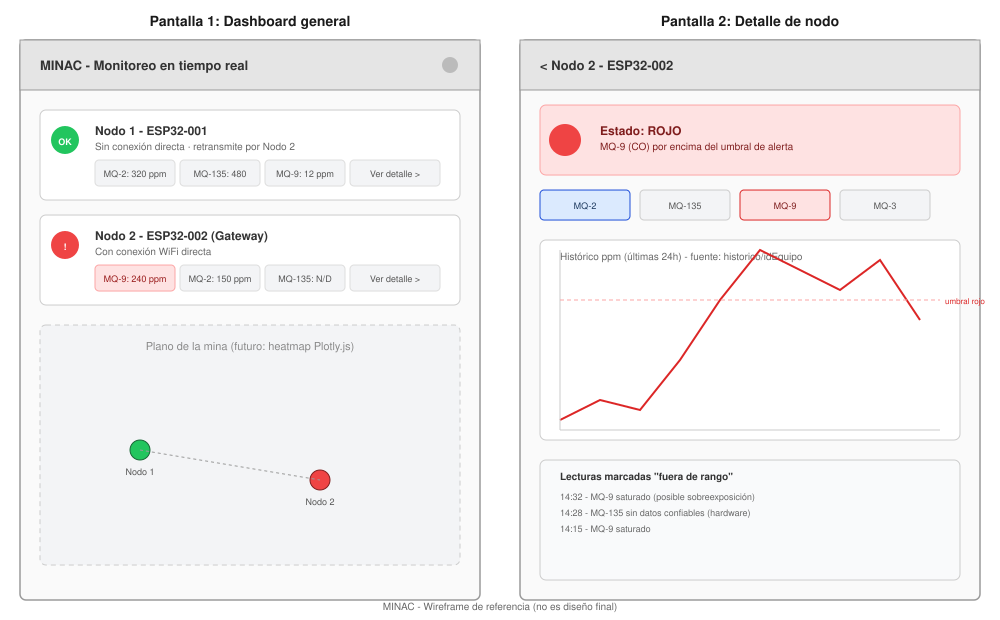

# MINAC — Documentación de Software

Cubre backend, frontend, flujo de datos y requerimientos pendientes para la entrega de la convocatoria.

---

## 1. Arquitectura general



```
ESP32 (calcula ppm + estado) --HTTP POST--> Backend NestJS --> Firebase RTDB --> Frontend Next.js
```

## 2. Backend (NestJS) — estado: casi listo

### 2.1 Qué ya está implementado

- Endpoint `POST /monitoreo`: recibe la lectura de un nodo, la valida con `class-validator`, y la guarda en Firebase.
- Endpoint `GET /monitoreo`: regresa el último valor de todos los equipos (para el dashboard en tiempo real).
- Endpoint `GET /monitoreo/historico/:idEquipo`: regresa la serie histórica completa de un equipo (para gráficas y la futura capa predictiva).
- Escritura dual en Firebase: valor más reciente + histórico completo (ningún dato se sobreescribe).

### 2.2 Qué datos se guardan

**`monitoreo/{idEquipo}`** — último valor conocido de cada nodo (se sobreescribe en cada lectura nueva):

```json
{
  "idEquipo": "ESP32-002",
  "mq2": 320.5,
  "mq3": 0.8,
  "mq135": 480.2,
  "mq9": 12.4,
  "timestamp": 1735689600000,
  "via": "directo",
  "fueraDeRango": ""
}
```

**`historico/{idEquipo}`** — cada lectura se agrega con clave única (push de Firebase), nunca se pierde:

```json
{
  "-Nabc123...": { "mq2": 320.5, "mq3": 0.8, "mq135": 480.2, "mq9": 12.4, "timestamp": 1735689600000, ... },
  "-Nabc124...": { "mq2": 318.1, "mq3": 0.7, "mq135": 475.0, "mq9": 13.1, "timestamp": 1735689605000, ... }
}
```

| Campo | Tipo | Descripción |
|---|---|---|
| `idEquipo` | string | Identificador del nodo (ej. `ESP32-001`) |
| `mq2`, `mq3`, `mq135`, `mq9` | number | Concentración en ppm ya calculada en el ESP32 |
| `timestamp` | number | Milisegundos desde el encendido del nodo (no reloj absoluto todavía — ver pendientes) |
| `via` | `"directo"` \| `"retransmitido"` | Si llegó directo a la API o a través de otro nodo |
| `retransmitidoPor` | string (opcional) | idEquipo del nodo que retransmitió, si aplica |
| `fueraDeRango` | string | Sensores cuya lectura salió del rango calibrado en esa muestra, separados por coma |

### 2.3 Requisitos pendientes del backend

- [ ] Vincular `idEquipo` a coordenadas físicas (colección `equipos` ya existente con `ubicacion`/`altura`) — necesario para el grafo de la capa predictiva.
- [ ] Cambiar `timestamp` de milisegundos-desde-encendido a timestamp absoluto (Unix epoch), para que el histórico sea comparable entre nodos y útil para entrenamiento del modelo.
- [ ] Definir si el frontend consume por polling (`GET` periódico) o si se agrega un mecanismo de tiempo real (WebSocket/Server-Sent Events) — impacta directamente el diseño del frontend.
- [ ] Endpoint de agregación por rango de fechas para no tener que descargar todo el histórico cada vez que el frontend pida una gráfica.

## 3. Frontend (Next.js) — pendiente de construir

### 3.1 Qué debe mostrar

1. **Vista general (dashboard):** lista o mapa de todos los nodos, cada uno con su semáforo de estado y el valor más reciente de sus 4 sensores.
2. **Vista de detalle por nodo:** gráfica histórica por gas (usando `GET /monitoreo/historico/:idEquipo`), y una lista de las lecturas marcadas `fueraDeRango` para que quede visible cuándo un dato no es confiable.

### 3.2 Cómo llegan los datos

- El frontend consume directamente los endpoints REST del backend (`GET /monitoreo` para la vista general, `GET /monitoreo/historico/:idEquipo` para el detalle).
- Mientras no se defina un mecanismo de tiempo real, el "tiempo real" se logra con **polling** (refrescar el fetch cada pocos segundos) — es la opción más simple para el tiempo que queda antes de la convocatoria; WebSockets es una mejora de fase posterior, no bloqueante para el MVP.

### 3.3 Requisitos del frontend

- [ ] Next.js + Plotly.js (ya definidos en el stack del proyecto).
- [ ] Componente de tarjeta de nodo con semáforo de color (verde/amarillo/rojo) — el color lo puede calcular el propio frontend con los mismos umbrales del hardware, o el backend puede exponerlo ya calculado (a decidir por el equipo, pero debe ser **el mismo criterio en ambos lados** para no mostrar información contradictoria).
- [ ] Gráfica de línea por gas, con marcador visual en los puntos `fueraDeRango`.
- [ ] Manejo explícito de "sin datos" para sensores con fallas conocidas (ej. MQ-135 del Nodo 2) — no ocultarlo, mostrarlo como dato de baja confianza.
- [ ] Vista responsiva mínima (la demo/pitch puede necesitar mostrarse en distintos dispositivos).

## 4. Wireframe de referencia



**Pantalla 1 — Dashboard general:** tarjetas por nodo con semáforo, valores de los 4 sensores, y acceso a detalle. Espacio reservado para plano de mina con nodos ubicados (fase posterior, cuando se vincule `idEquipo` con coordenadas).

**Pantalla 2 — Detalle de nodo:** estado actual destacado, selector de gas, gráfica histórica con línea de umbral de alerta marcada, y tabla de lecturas fuera de rango con timestamp.

> Este wireframe es una referencia de estructura, no el diseño visual final — el equipo de frontend tiene libertad de estilo siempre que mantenga esta jerarquía de información.

## 5. Resumen de pendientes por prioridad

| Prioridad | Tarea | Equipo |
|---|---|---|
| Alta | Vincular idEquipo con coordenadas | Backend |
| Alta | Construir Pantalla 1 (dashboard general) | Frontend |
| Alta | Construir Pantalla 2 (detalle + histórico) | Frontend |
| Media | Timestamp absoluto en vez de millis() | Backend + Firmware |
| Media | Definir polling vs. tiempo real | Backend + Frontend (decisión conjunta) |
| Baja | Endpoint de agregación por fechas | Backend |
