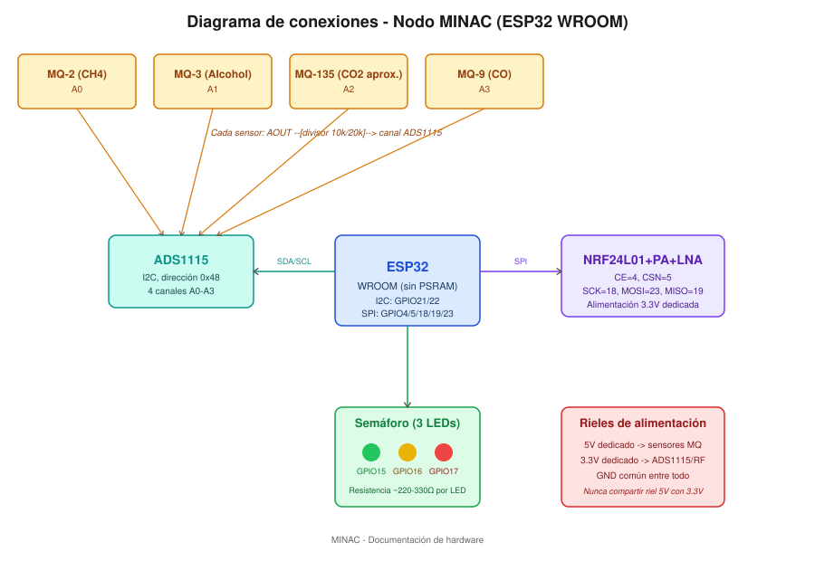
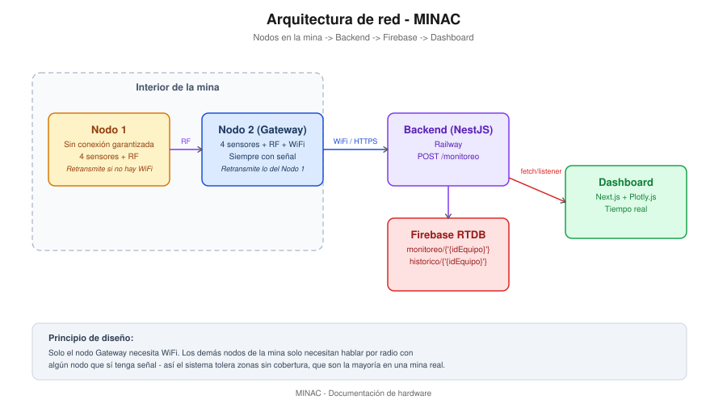

# MINAC — Documentación de Hardware

Sistema de monitoreo de gases tóxicos para minas subterráneas. Este documento cubre las conexiones del circuito, la lógica de operación de cada nodo, y la arquitectura de red del sistema.

---

## 1. Resumen del sistema

Cada nodo es un ESP32 con 4 sensores de gas, un módulo de radio para comunicación entre nodos, y un semáforo visual de 3 LEDs. El sistema está compuesto por 2 nodos:

- **Nodo 1**: sin conexión WiFi garantizada. Retransmite sus lecturas por radio si no tiene señal.
- **Nodo 2 (Gateway)**: siempre con conexión WiFi. Sube sus propias lecturas y retransmite las del Nodo 1 a la API.

## 2. Lista de materiales por nodo

| Componente | Cantidad | Notas |
|---|---|---|
| ESP32 WROOM (sin PSRAM) | 1 | GPIO16/17 libres por no tener PSRAM |
| ADS1115 (ADC externo I2C) | 1 | 4 canales, dirección 0x48 |
| Sensor MQ-2 (CH4/combustibles) | 1 | Canal A0 |
| Sensor MQ-3 (Alcohol) | 1 | Canal A1 — solo validación metodológica |
| Sensor MQ-135 (CO2 aprox.) | 1 | Canal A2 |
| Sensor MQ-9 (CO) | 1 | Canal A3 |
| NRF24L01+PA+LNA | 1 | Comunicación entre nodos |
| LEDs (verde, amarillo, rojo) | 3 | Semáforo visual |
| Resistencias 220-330Ω | 3 | Una por LED |
| Resistencias para divisor de voltaje | 4x (10kΩ + 20kΩ) | Una por sensor MQ |
| Fuente 5V dedicada | 1 | Para los sensores MQ (calentadores) |
| Fuente 3.3V dedicada | 1 | Para ADS1115 y NRF24L01 |

## 3. Diagrama de conexiones



### Detalle por bloque

**ADS1115 ↔ ESP32 (I2C)**
| Línea | Pin |
|---|---|
| SDA | GPIO21 |
| SCL | GPIO22 |
| VDD | 3.3V dedicado |
| GND | Tierra común |
| ADDR | GND (fija dirección 0x48) |

**Sensores MQ ↔ ADS1115** — cada sensor pasa por un divisor de voltaje (R1=10kΩ, R2=20kΩ) antes de llegar al canal, para no exceder el límite de entrada del ADS1115 (alimentado a 3.3V):

```
Sensor AOUT (0-5V) --[R1=10kΩ]-- nodo --[R2=20kΩ]-- GND
                                  │
                            canal A0-A3 del ADS1115
```

| Sensor | Canal |
|---|---|
| MQ-2 | A0 |
| MQ-3 | A1 |
| MQ-135 | A2 |
| MQ-9 | A3 |

**NRF24L01+PA+LNA ↔ ESP32 (SPI)**
| Línea | Pin |
|---|---|
| CE | GPIO4 |
| CSN | GPIO5 |
| SCK | GPIO18 |
| MOSI | GPIO23 |
| MISO | GPIO19 |
| VCC | 3.3V dedicado con capacitor de desacople (10-100µF) |

**Semáforo (3 LEDs)**
| LED | Pin |
|---|---|
| Verde | GPIO15 |
| Amarillo | GPIO16 |
| Rojo | GPIO17 |

> ⚠️ **Regla de oro de alimentación:** los sensores MQ (5V) y la lógica ADS1115/NRF24L01 (3.3V) nunca deben compartir riel de voltaje, solo tierra común. Conectar el AOUT de un sensor sin el divisor puede dañar el ADC permanentemente.

## 4. Lógica de funcionamiento

### 4.1 Calibración (Rs/R0)

Cada sensor se calibra midiendo su voltaje de referencia en aire limpio (`Vout0`) tras un periodo de precalentamiento (burn-in de 24-48h en primer uso). La razón Rs/R0 se calcula sin necesitar conocer la resistencia de carga interna del módulo (se cancela matemáticamente):

```
Rs/R0 = [(Vc − Vout) / Vout] / [(Vc − Vout0) / Vout0]
```

### 4.2 Conversión a ppm

Con coeficientes extraídos de las curvas del datasheet de cada sensor:

```
ppm = a × (Rs/R0)^b
```

Cada lectura se valida contra el rango de Rs/R0 que el datasheet realmente caracterizó — si sale de ese rango, se marca como **no confiable** en vez de reportar un número con falsa precisión.

### 4.3 Semáforo de alerta

Solo **MQ-2, MQ-135 y MQ-9** participan en la decisión de color (el MQ-3 no corresponde a ningún gas objetivo de MINAC, se usa solo como validación metodológica del proceso de calibración).

| Estado | Condición |
|---|---|
| 🟢 Verde | Todos los sensores dentro de umbral seguro |
| 🟡 Amarillo | Al menos un sensor en umbral de precaución |
| 🔴 Rojo | Al menos un sensor supera el umbral de alerta, **o** algún sensor está fuera del rango calibrado (se asume el peor caso por seguridad) |

| Sensor | Amarillo | Rojo |
|---|---|---|
| MQ-2 | ≥1,000 ppm | ≥5,000 ppm |
| MQ-135 | ≥1,000 ppm | ≥5,000 ppm |
| MQ-9 | ≥35 ppm | ≥200 ppm |

> Estos umbrales son referencias de exposición ocupacional general (NIOSH/OSHA), no una certificación NOM-023-STPS. Se documentan así explícitamente para mantener la clasificación de fase temprana ante la convocatoria.

### 4.4 Comunicación resiliente

- Cada nodo intenta subir su lectura directo por WiFi.
- Si no hay señal (Nodo 1), retransmite por radio al Gateway (Nodo 2), que la reenvía a la API etiquetada con su nodo de origen real.
- Cada lectura enviada incluye qué sensores estaban fuera de rango en ese momento (`fueraDeRango`), para que el sistema aguas abajo sepa qué tan confiable es cada dato.

## 5. Arquitectura de red



**Principio de diseño:** solo el nodo Gateway necesita WiFi. El resto de los nodos de la mina solo necesitan alcanzar por radio a algún nodo que sí tenga señal — así el sistema tolera zonas sin cobertura, que son la mayoría en un entorno minero real.

## 6. Limitaciones conocidas (documentadas honestamente para la convocatoria)

- El MQ-135 del Nodo 2 presentó lecturas inconsistentes durante pruebas de laboratorio (posible falla de hardware o conexión) — pendiente de diagnóstico.
- Ningún sensor actual mide SO₂ ni déficit de O₂ directamente — hueco de cobertura frente a los 6 gases objetivo de MINAC, documentado como línea de trabajo futura.
- Los coeficientes de conversión a ppm del MQ-9 se obtuvieron por lectura visual de la gráfica del datasheet, no de una tabla numérica ni herramienta de extracción de precisión — suficiente para fase temprana, pendiente de refinar.
- El sistema no incluye ventilación forzada (se evaluó y se descartó para el MVP; ver justificación en el documento de la convocatoria).
